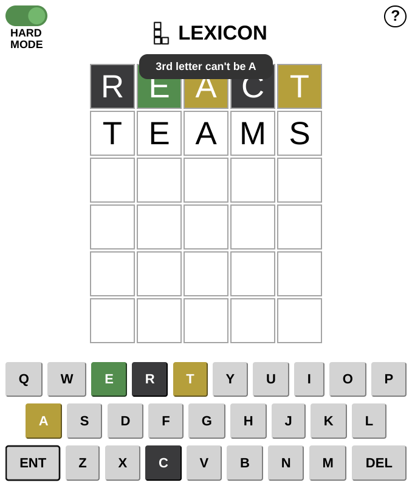

# Lexicon

Lexicon is a word game, based on the popular NY Times game Wordle.

Players are given six guesses to reveal the target word. After each guess, the colours of the tiles change to reveal whether that letter is in the word, and if it is, whether it is in the correct place. A new target word is randomly generated from a list of over 2700 every time the page is refreshed.

## Hard Mode

The idea behind Lexicon was to make a version of the game where Hard Mode really meant Hard Mode. In the NY Times version, players can still use letters that have been revealed to not be in the word, as well as guess letters in a place in the word that has been revealed to be wrong. Lexicon fixes that, making for an even more challenging experience.

Once a game is started in Hard Mode, it cannot be turned off!

## Tech

Lexicon was built in React.js, with a simple Express/Node.js server, and is cloud hosted through Heroku.com.

It was built in October 2022 by Dave Kempsell, as a follow on project after finishing the Makers Academy bootcamp. It doesn't follow any of the numerous wordle clone youtube tutorials, as the project was undertaken as an exercise in problem solving the challenges faced when implementing the logic behind the game.

